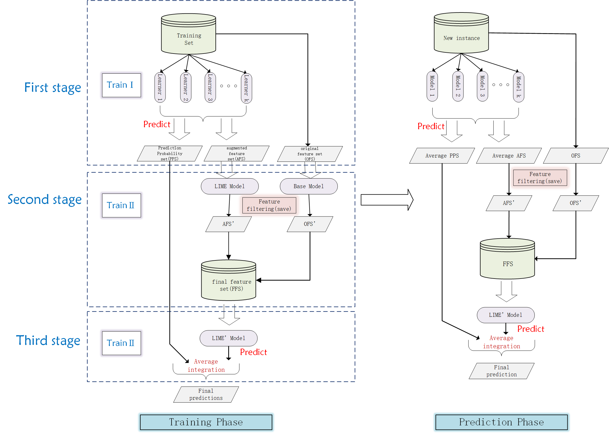

# LEAF

这是论文 **通过使用局部可解释模型无关解释进行特征增强的中小企业融资担保评估** 中提出的 LEAF 方法的代码。[英文文档](./README.md)

## **所提模型的框架**

	在本研究中，我们通过 LIME 有效地扩展了现有特征集，生成了一个新的增强特征集（AFS）。与此同时，为了充分利用原始数据的预测结果，我们使用原始特征集（OFS）训练了一个模型，获得了相应的折外（OOF）预测概率。随后，我们为 OFS 和 AFS 分别训练了两个第二阶段模型。通过特征筛选，我们获得了过滤后的样本数据库和过滤后的 LIME 数据（LIME'），从而构建了经过特征筛选的数据集，即改进的原始特征集（OFS'）和增强的增强特征集（AFS'）。最后，我们将 OFS' 和 AFS' 合并，构建了最终特征集（FFS），并训练了第三阶段模型。在预测阶段，我们对第一阶段和第三阶段模型的输出取平均值，以提高模型的泛化能力，最终得到最终的预测结果。
	
	该算法采用多个模型进行预测，增强了方法的泛化能力和捕获全面信息的能力。这种方法有助于提升预测模型的性能和稳定性。

## 数据集：

	如果您的数据集是二分类数据集，请以 CSV 格式将其存储在 binary 文件夹中；如果它是多分类数据集，请存储在 muti_class 文件夹中。这里我们以二分类数据集为例，该数据集已存储到 binary 文件中，其中“评估资产”列是二分类标签，1 表示通过，0 表示未通过。

## 运行代码：

python main.py --task=**binary or multi** --model_name=**xgb or lgbm or random_forest** --seed=**A number of your choice, we used 42**  

例如: python main.py  --task=binary --model_name=xgb --seed=42